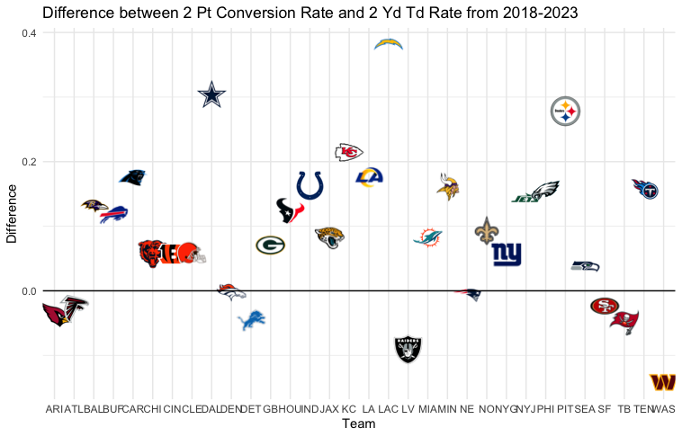

## **Are NFL teams more likely to make a two-point conversion or a touchdown from the two-yard line?**

Using two-sample t-tests to demonstrate why two-point conversions and touchdowns from the two-yard line lead to significantly different outcomes.

**Methodology**

I used data from nflfastR which tracks every play from the NFL going back to 1999. Since the NFL has changed quite a bit since then, I only looked at data from the past 5 seasons (2018-2023).

**Results**

From 2018-2023, the average team made a two-point conversion 49.4% of the time (with a standard deviation of 0.0981), while making touchdowns from the two-yard line 40.5% of the time (with a standard deviation of 0.0638).

Using Welch's two-sample t-test, comparing the two-point conversion rates of all teams and the two-yard touchdown rates of all teams, we get a p-value of 7.152E-05, meaning we reject the hypothesis and conclude the alternative hypothesis that there is a statistically significant difference between the two rates.
